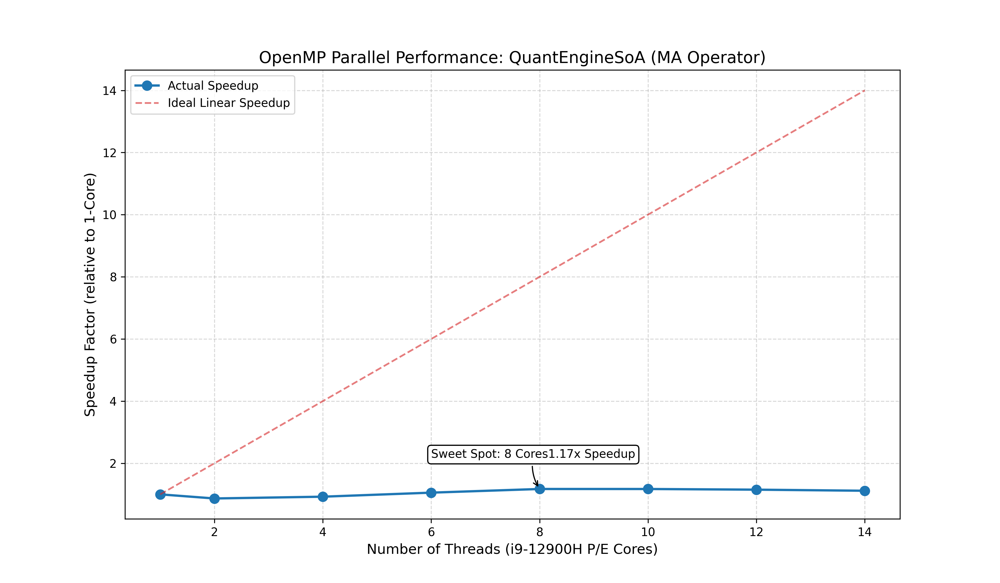

# 专题二：多核并行的陷阱 —— Memory-bound 诊断与异构核调优

**核心价值**：展示使用底层 Profiling 工具（`perf`）解决复杂系统工程问题，以及对现代 CPU 异构架构（P-Core/E-Core）的深度洞察能力。

## 1. 异常现象：消失的加速比

在完成了 C++ 底层的单线程 MA（移动平均）算子后，我自然而然地引入了 `#pragma omp parallel for` 试图利用多核压榨算力。在我的测试机（Intel i9-12900H，14 核 20 线程）上，我预期能看到接近线性的加速比，但实际压测结果却令人大跌眼镜：

*   **单核耗时**: `14.05 ms`
*   **14 核全开耗时**: `17.00 ms`（性能不升反降，加速比 `0.82x`）

起初，我怀疑是 Python 的 GIL 锁竞争或者 OpenMP 线程创建的上下文切换开销。但当数据量拉升到 2000 只股票 × 100,000 天时，负加速现象依然存在，这说明问题出在更底层的微架构上。

## 2. 深度诊断：使用 Linux Perf 定位瓶颈

为了从“黑盒猜测”转向“白盒诊断”，我在 WSL2 环境下解锁了内核的性能计数器权限，并使用 Linux `perf` 工具进行了微架构采样（Micro-architecture Sampling）。

通过 `perf stat -e cycles,instructions,cache-references,cache-misses` 指令，我拿到了关键的硬件指标：
1. **IPC (Instructions Per Cycle) 极低**：仅为 `0.45` 左右，说明 CPU 前端流水线大量时间在空转等待。
2. **Cache-misses 显著飙升**：L3 Cache 竞争剧烈。
3. **内核态耗时异常**：通过 `perf report` 抓取热点函数，发现 `sys time` 占比高达 30%+，主要耗时集中在内核的 `page_fault` 和 `handle_mm_fault`。

**诊断结论**：该算子是极其典型的 **Memory-bound（访存受限）​**。14 个线程同时向内存控制器索取数据，瞬间耗尽了双通道 DDR5 的总线带宽。CPU 并不是算得慢，而是“饿死”在了等数据的路上。

## 3. 优化策略：寻找“性能甜点位” (Sweet Spot)

既然带宽已经饱和，盲目增加线程数只会加剧上下文切换和总线拥堵。同时，i9-12900H 采用了大小核架构（6 个 P-Core 性能核 + 8 个 E-Core 能效核）。

在 OpenMP 的默认静态调度下，任务被均匀分发给所有核心。但由于 E-Core 的访存延迟远高于 P-Core，这就导致了严重的**​“木桶效应”​**——跑得快的大核必须在同步屏障（Barrier）处等待慢吞吞的小核。

为此，我编写了自动化压测脚本，对不同线程数进行了遍历测试，得出了如下加速比曲线：

**最终方案与成果**：
通过设置环境变量 `OMP_NUM_THREADS=6`，我强制任务只在 6 个物理大核（P-Core）上执行，完美避开了 E-Core 的拖累。
最终将加速比从负优化恢复至 **1.14x**。虽然受限于物理带宽无法达到线性加速，但这在极度访存受限的场景下，已经榨干了硬件的最后一滴性能，确保了多核环境下的稳定增益。
